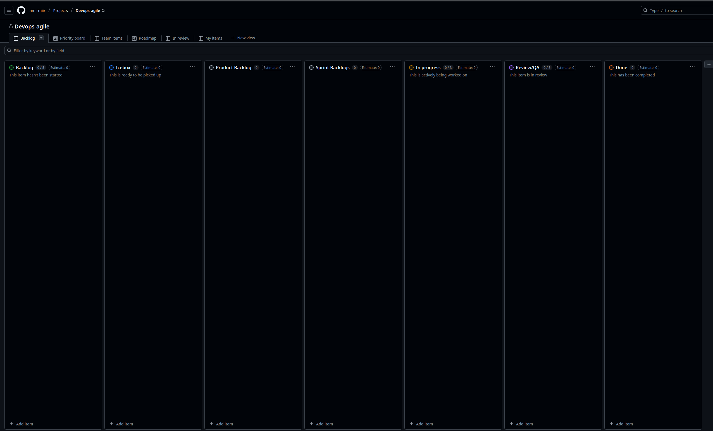

# Actividad17 - Reporte

## Parte 1: Github Projects -  Configuración de Kanban Board





## Parte 2: Creación de issue template

### Crea una issue template en github


## Parte 3: Creación de siete historias de usuarios

### Crear nuevas historias de usuario usando github issues

Se realizaron una modificacion en labels para poder marcar como user story: 

````markdown
amirmiir@zenbook14-aacg-EndOS:~/Escritorio/UNI/CC3S2-SD-251/.github/ISSUE_TEMPLATE(main)$ cat user-story.md 
---
name: User Story
about: This is the user story for the CC3S2 - Activity17 - Part 2.
title: ''
labels: '["user story"]'
assignees: ''

---

---
name: User Story
about: Template for defining clear and structured user stories
title: "[User Story] <Short Title>"
labels: ["user story"]
assignees: ""
---

## User story  

**As a** _(specific role - e.g., "developer," "admin," "customer")_  
**I need** _(clear functionality or feature needed)_  
**So that** _(explain the value or business reason for this feature)_

---

##  **Context & Assumptions**  
- _List any known constraints, assumptions, or dependencies._
- _Mention related user stories or issues (if applicable)._

---

##  **Acceptance criteria**  
```gherkin
Scenario: <Short Description>
Given <initial context or system state>
When <user performs an action>
Then <expected outcome or behavior>
And <optional additional conditions>
````


#### Historias de la lección:

##### 1. Creación de issues


##### Adición de issues al Kanban board


##### Ejercicio: Priorizar el product backlog

###### 

