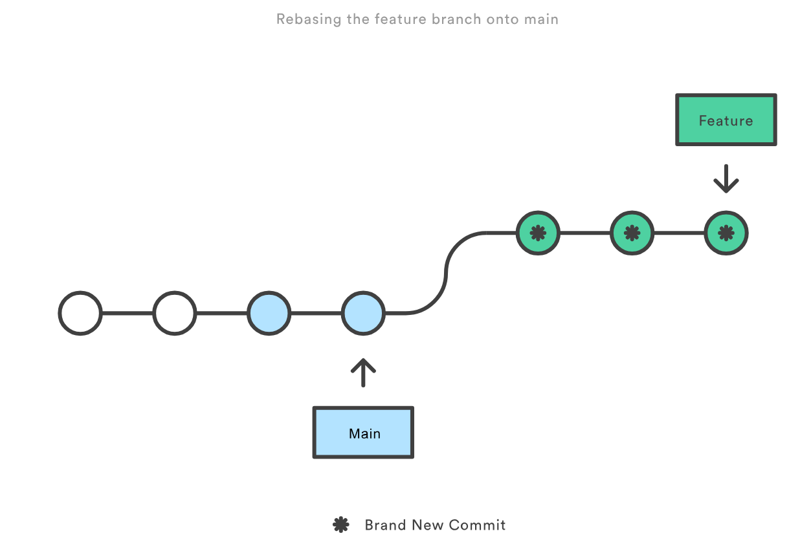
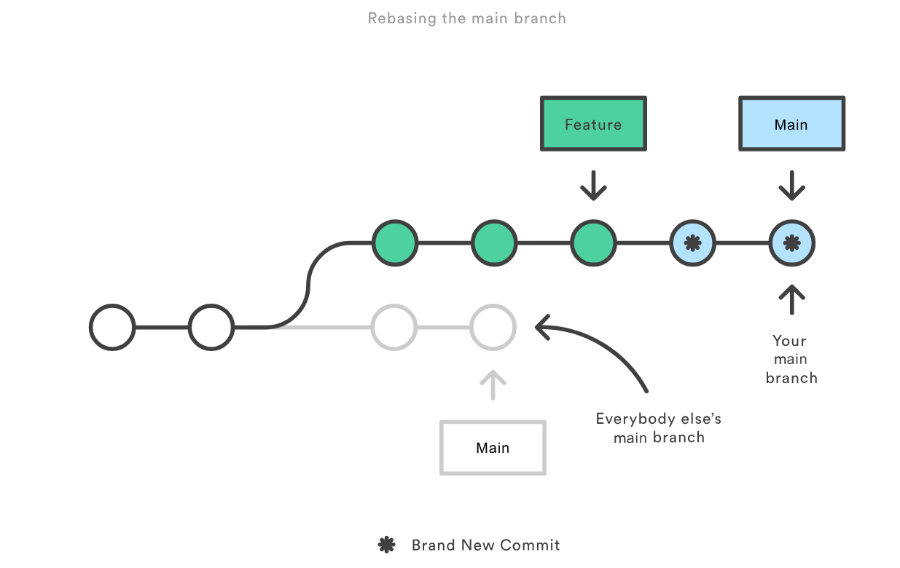

### Parte 1 Git Rebase

```bash
amirmiir@zenbook14-aacg-EndOS:~/Escritorio/UNI/ds-251/Actividad6(main)$ mkdir prueba-git-rebase
amirmiir@zenbook14-aacg-EndOS:~/Escritorio/UNI/ds-251/Actividad6(main)$ cd prueba-git-rebase/
amirmiir@zenbook14-aacg-EndOS:~/Escritorio/UNI/ds-251/Actividad6/prueba-git-rebase(main)$ git init
Initialized empty Git repository in /home/amirmiir/Escritorio/UNI/ds-251/Actividad6/prueba-git-rebase/.git/
amirmiir@zenbook14-aacg-EndOS:~/Escritorio/UNI/ds-251/Actividad6/prueba-git-rebase$ echo "# Mi Proyecto de Rebase" > README.md
amirmiir@zenbook14-aacg-EndOS:~/Escritorio/UNI/ds-251/Actividad6/prueba-git-rebase$ git add README.md
amirmiir@zenbook14-aacg-EndOS:~/Escritorio/UNI/ds-251/Actividad6/prueba-git-rebase$ git commit -m "Commit inicial en main"
[main (root-commit) 2857698] Commit inicial en main
 1 file changed, 1 insertion(+)
 create mode 100644 README.md
amirmiir@zenbook14-aacg-EndOS:~/Escritorio/UNI/ds-251/Actividad6/prueba-git-rebase(main)$ 
amirmiir@zenbook14-aacg-EndOS:~/Escritorio/UNI/ds-251/Actividad6/prueba-git-rebase(main)$ git checkout -b new-feature
Switched to a new branch 'new-feature'
amirmiir@zenbook14-aacg-EndOS:~/Escritorio/UNI/ds-251/Actividad6/prueba-git-rebase(new-feature)$ echo "Esta es una nueva caracteristica." > NewFeature.md
amirmiir@zenbook14-aacg-EndOS:~/Escritorio/UNI/ds-251/Actividad6/prueba-git-rebase(new-feature)$ git add NewFeature.md 
amirmiir@zenbook14-aacg-EndOS:~/Escritorio/UNI/ds-251/Actividad6/prueba-git-rebase(new-feature)$ git commit -m "Agregar nueva caracteristica"
[new-feature 757fc70] Agregar nueva caracteristica
 1 file changed, 1 insertion(+)
 create mode 100644 NewFeature.md
amirmiir@zenbook14-aacg-EndOS:~/Escritorio/UNI/ds-251/Actividad6/prueba-git-rebase(new-feature)$ 
amirmiir@zenbook14-aacg-EndOS:~/Escritorio/UNI/ds-251/Actividad6/prueba-git-rebase(new-feature)$ git branch
  main
* new-feature
amirmiir@zenbook14-aacg-EndOS:~/Escritorio/UNI/ds-251/Actividad6/prueba-git-rebase(new-feature)$ git log --graph --oneline --all --decorate
* 757fc70 (HEAD -> new-feature) Agregar nueva caracteristica
* 2857698 (main) Commit inicial en main
amirmiir@zenbook14-aacg-EndOS:~/Escritorio/UNI/ds-251/Actividad6/prueba-git-rebase(new-feature)$ 

```

```bash
amirmiir@zenbook14-aacg-EndOS:~/Escritorio/UNI/ds-251/Actividad6/prueba-git-rebase(new-feature)$ git checkout main
Switched to branch 'main'
amirmiir@zenbook14-aacg-EndOS:~/Escritorio/UNI/ds-251/Actividad6/prueba-git-rebase(main)$ echo "Updates to the project." >> Updates.md
amirmiir@zenbook14-aacg-EndOS:~/Escritorio/UNI/ds-251/Actividad6/prueba-git-rebase(main)$ git add Updates.md 
amirmiir@zenbook14-aacg-EndOS:~/Escritorio/UNI/ds-251/Actividad6/prueba-git-rebase(main)$ git commit -m "Update main"
[main d56508a] Update main
 1 file changed, 1 insertion(+)
 create mode 100644 Updates.md
amirmiir@zenbook14-aacg-EndOS:~/Escritorio/UNI/ds-251/Actividad6/prueba-git-rebase(main)$ 
amirmiir@zenbook14-aacg-EndOS:~/Escritorio/UNI/ds-251/Actividad6/prueba-git-rebase(main)$ git checkout new-feature 
Switched to branch 'new-feature'
amirmiir@zenbook14-aacg-EndOS:~/Escritorio/UNI/ds-251/Actividad6/prueba-git-rebase(new-feature)$ git rebase main
Successfully rebased and updated refs/heads/new-feature.
amirmiir@zenbook14-aacg-EndOS:~/Escritorio/UNI/ds-251/Actividad6/prueba-git-rebase(new-feature)$ git log --graph --oneline
* f95e1a5 (HEAD -> new-feature) Agregar nueva caracteristica
* d56508a (main) Update main
* 2857698 Commit inicial en main
amirmiir@zenbook14-aacg-EndOS:~/Escritorio/UNI/ds-251/Actividad6/prueba-git-rebase(new-feature)$ 

```

Merge fast forward

```bash
amirmiir@zenbook14-aacg-EndOS:~/Escritorio/UNI/ds-251/Actividad6/prueba-git-rebase(new-feature)$ git checkout main
Switched to branch 'main'
amirmiir@zenbook14-aacg-EndOS:~/Escritorio/UNI/ds-251/Actividad6/prueba-git-rebase(main)$ git merge new-feature 
Updating d56508a..f95e1a5
Fast-forward
 NewFeature.md | 1 +
 1 file changed, 1 insertion(+)
 create mode 100644 NewFeature.md
amirmiir@zenbook14-aacg-EndOS:~/Escritorio/UNI/ds-251/Actividad6/prueba-git-rebase(main)$ 
amirmiir@zenbook14-aacg-EndOS:~/Escritorio/UNI/ds-251/Actividad6/prueba-git-rebase(main)$ git log --graph --oneline
* f95e1a5 (HEAD -> main, new-feature) Agregar nueva caracteristica
* d56508a Update main
* 2857698 Commit inicial en main
amirmiir@zenbook14-aacg-EndOS:~/Escritorio/UNI/ds-251/Actividad6/prueba-git-rebase(main)$ 


```


### Parte 2 Cherry Pick

Inicializacion

```bash
amirmiir@zenbook14-aacg-EndOS:~/Escritorio/UNI/ds-251/Actividad6(main)$ mkdir prueba-cherry-pick
amirmiir@zenbook14-aacg-EndOS:~/Escritorio/UNI/ds-251/Actividad6(main)$ cd prueba-cherry-pick/
amirmiir@zenbook14-aacg-EndOS:~/Escritorio/UNI/ds-251/Actividad6/prueba-cherry-pick(main)$ git init
Initialized empty Git repository in /home/amirmiir/Escritorio/UNI/ds-251/Actividad6/prueba-cherry-pick/.git/
amirmiir@zenbook14-aacg-EndOS:~/Escritorio/UNI/ds-251/Actividad6/prueba-cherry-pick$ echo "# Mi proyecto" > README.md
amirmiir@zenbook14-aacg-EndOS:~/Escritorio/UNI/ds-251/Actividad6/prueba-cherry-pick$ git add README.md 
amirmiir@zenbook14-aacg-EndOS:~/Escritorio/UNI/ds-251/Actividad6/prueba-cherry-pick$ git commit -m "Commit inicial"
[main (root-commit) 4b74410] Commit inicial
 1 file changed, 1 insertion(+)
 create mode 100644 README.md
amirmiir@zenbook14-aacg-EndOS:~/Escritorio/UNI/ds-251/Actividad6/prueba-cherry-pick(main)$ git checkout -b add-base-documents
Switched to a new branch 'add-base-documents'
amirmiir@zenbook14-aacg-EndOS:~/Escritorio/UNI/ds-251/Actividad6/prueba-cherry-pick(add-base-documents)$ 
amirmiir@zenbook14-aacg-EndOS:~/Escritorio/UNI/ds-251/Actividad6/prueba-cherry-pick(add-base-documents)$ echo "# CONTRIBUTING" >> CONTRIBUTING.md
amirmiir@zenbook14-aacg-EndOS:~/Escritorio/UNI/ds-251/Actividad6/prueba-cherry-pick(add-base-documents)$ git add CONTRIBUTING.md 
amirmiir@zenbook14-aacg-EndOS:~/Escritorio/UNI/ds-251/Actividad6/prueba-cherry-pick(add-base-documents)$ git commit -m "Se agrega CONTRIBUTING.md"
[add-base-documents 86a6fb7] Se agrega CONTRIBUTING.md
 1 file changed, 1 insertion(+)
 create mode 100644 CONTRIBUTING.md
amirmiir@zenbook14-aacg-EndOS:~/Escritorio/UNI/ds-251/Actividad6/prueba-cherry-pick(add-base-documents)$ 
amirmiir@zenbook14-aacg-EndOS:~/Escritorio/UNI/ds-251/Actividad6/prueba-cherry-pick(add-base-documents)$ echo "LICENSE" >> LICENSE.txt
amirmiir@zenbook14-aacg-EndOS:~/Escritorio/UNI/ds-251/Actividad6/prueba-cherry-pick(add-base-documents)$ git add LICENSE.txt 
amirmiir@zenbook14-aacg-EndOS:~/Escritorio/UNI/ds-251/Actividad6/prueba-cherry-pick(add-base-documents)$ git commit -m "Agrega LICENSE.txt"
[add-base-documents 9db0cd7] Agrega LICENSE.txt
 1 file changed, 1 insertion(+)
 create mode 100644 LICENSE.txt
amirmiir@zenbook14-aacg-EndOS:~/Escritorio/UNI/ds-251/Actividad6/prueba-cherry-pick(add-base-documents)$ git log add-base-documents --graph --oneline
* 9db0cd7 (HEAD -> add-base-documents) Agrega LICENSE.txt
* 86a6fb7 Se agrega CONTRIBUTING.md
* 4b74410 (main) Commit inicial
amirmiir@zenbook14-aacg-EndOS:~/Escritorio/UNI/ds-251/Actividad6/prueba-cherry-pick(add-base-documents)$ 
amirmiir@zenbook14-aacg-EndOS:~/Escritorio/UNI/ds-251/Actividad6/prueba-cherry-pick(add-base-documents)$ git log --graph --oneline --all --decorate
* 9db0cd7 (HEAD -> add-base-documents) Agrega LICENSE.txt
* 86a6fb7 Se agrega CONTRIBUTING.md
* 4b74410 (main) Commit inicial
amirmiir@zenbook14-aacg-EndOS:~/Escritorio/UNI/ds-251/Actividad6/prueba-cherry-pick(add-base-documents)$  

```

 hacemos cherry-pick al commit más reciente:

```bash
amirmiir@zenbook14-aacg-EndOS:~/Escritorio/UNI/ds-251/Actividad6/prueba-cherry-pick(add-base-documents)$ git checkout main
Switched to branch 'main'
amirmiir@zenbook14-aacg-EndOS:~/Escritorio/UNI/ds-251/Actividad6/prueba-cherry-pick(main)$ git cherry-pick 9db0cd7
[main 0711d67] Agrega LICENSE.txt
 Date: Mon Apr 21 10:49:36 2025 -0500
 1 file changed, 1 insertion(+)
 create mode 100644 LICENSE.txt
amirmiir@zenbook14-aacg-EndOS:~/Escritorio/UNI/ds-251/Actividad6/prueba-cherry-pick(main)$ 
amirmiir@zenbook14-aacg-EndOS:~/Escritorio/UNI/ds-251/Actividad6/prueba-cherry-pick(main)$ git log --graph --oneline
* 0711d67 (HEAD -> main) Agrega LICENSE.txt
* 4b74410 Commit inicial
amirmiir@zenbook14-aacg-EndOS:~/Escritorio/UNI/ds-251/Actividad6/prueba-cherry-pick(main)$ 

```

Notemos que tiene un hash diferente. 0711d67 != 9db0cd7

### Preguntas

#### 1. ¿Por qué se considera que rebase es más útil para mantener un historial de proyecto lineal en comparación con merge?

Porque permite mantener un historial más limpio, ya que mueve la rama completa, incorporando los commits como nuevos al main. De esta manera se puede realizar un seguimiento más detallado de los commits realizados.



Pero se debe tener cuidado al hacer rebase, pues no se debe realizar en ramas públicas, pues se produce el siguiente fenómeno en el cual nuestra rama main, a ojos de Git, ha divergido de las ramas main de los demás usuarios. Esto solo tiene como solución el realizar un merge, lo cual resulta en una duplicación del historial y termina siendo una peor alternativa.



#### 2. ¿Qué problemas potenciales podrían surgir si haces rebase en una rama compartida con otros miembros del equipo?

Como explique en la pregunta anterior, se puede presentar la divergencia en una misma rama resultando en la necesidad de realizar un merge para solucionar estas diferencias y, por ende, la duplicación de commits realizados, resultando en un historial aún más desordenado y complicado de seguir.

#### 3. ¿En qué se diferencia cherry-pick de merge, y en qué situaciones preferirías uno sobre el otro?

cherry-pick elige de manera individual qué commit añadir, mientras que merge fusiona dos ramas juntando cambios realizados a lo largo de varios commits.
En caso que se siga trabajando en commits posteriores y necesite una versión más estable que se encuentra en un commit específico, realizaría ``` git cherry-pick <hash>```. Mientras que merge lo eligiría si ya se culminó el proposito de una rama por completo y no se planea continuar realizando cambios.

#### 4. ¿Por qué es importante evitar hacer rebase en ramas públicas?

Se basa en la Golden rule para rebase, la cual nos indica los riesgos de realizar un rebase en una rama compartida, similar a como explique en las primeras dos preguntas.


### Ejercicios Teóricos

#### 1. Diferencias entre git merge y git rebase

 **Pregunta**: Explica la diferencia entre git merge y git  rebase y describe en qué escenarios sería más adecuado utilizar cada uno en un equipo de desarrollo ágil que sigue las prácticas de Scrum.


#### 2. **Relación entre git rebase y DevOps**
 **Pregunta**: ¿Cómo crees que el uso de git rebase ayuda a  mejorar las prácticas de DevOps, especialmente en la implementación  continua (CI/CD)? Discute los beneficios de mantener un historial lineal en el contexto de una entrega continua de código y la automatización de pipelines.

#### 3. **Impacto del git cherry-pick en un equipo Scrum**

 **Pregunta**: Un equipo Scrum ha finalizado un sprint, pero durante la integración final a la rama principal (main) descubren que  solo algunos commits específicos de la rama de una funcionalidad deben  aplicarse a producción. ¿Cómo podría ayudar git cherry-pick en este  caso? Explica los beneficios y posibles complicaciones.

### Ejercicios Prácticos

#### **1. Simulación de un flujo de trabajo Scrum con git rebase y git merge**

```bash
amirmiir@zenbook14-aacg-EndOS:~/Escritorio/UNI/ds-251/Actividad6(main)$ mkdir scrum-workflow
amirmiir@zenbook14-aacg-EndOS:~/Escritorio/UNI/ds-251/Actividad6(main)$ cd scrum-workflow/
amirmiir@zenbook14-aacg-EndOS:~/Escritorio/UNI/ds-251/Actividad6/scrum-workflow(main)$ git init
Initialized empty Git repository in /home/amirmiir/Escritorio/UNI/ds-251/Actividad6/scrum-workflow/.git/
amirmiir@zenbook14-aacg-EndOS:~/Escritorio/UNI/ds-251/Actividad6/scrum-workflow$ echo "Commit inicial en main" > mainfile.md
amirmiir@zenbook14-aacg-EndOS:~/Escritorio/UNI/ds-251/Actividad6/scrum-workflow$ git add mainfile.md 
amirmiir@zenbook14-aacg-EndOS:~/Escritorio/UNI/ds-251/Actividad6/scrum-workflow$ git commit -m "Commit inicial en main"
[main (root-commit) 581e55c] Commit inicial en main
 1 file changed, 1 insertion(+)
 create mode 100644 mainfile.md
amirmiir@zenbook14-aacg-EndOS:~/Escritorio/UNI/ds-251/Actividad6/scrum-workflow(main)$ 
amirmiir@zenbook14-aacg-EndOS:~/Escritorio/UNI/ds-251/Actividad6/scrum-workflow(main)$ git checkout -b feature
Switched to a new branch 'feature'
amirmiir@zenbook14-aacg-EndOS:~/Escritorio/UNI/ds-251/Actividad6/scrum-workflow(feature)$ echo "Nueva caracteristica en feature" > featurefile.md
amirmiir@zenbook14-aacg-EndOS:~/Escritorio/UNI/ds-251/Actividad6/scrum-workflow(feature)$ git add featurefile.md 
amirmiir@zenbook14-aacg-EndOS:~/Escritorio/UNI/ds-251/Actividad6/scrum-workflow(feature)$ git commit -m "Commit en feature"
[feature 00638e2] Commit en feature
 1 file changed, 1 insertion(+)
 create mode 100644 featurefile.md
amirmiir@zenbook14-aacg-EndOS:~/Escritorio/UNI/ds-251/Actividad6/scrum-workflow(feature)$ 
amirmiir@zenbook14-aacg-EndOS:~/Escritorio/UNI/ds-251/Actividad6/scrum-workflow(feature)$ git checkout main
Switched to branch 'main'
amirmiir@zenbook14-aacg-EndOS:~/Escritorio/UNI/ds-251/Actividad6/scrum-workflow(main)$ echo "Actualizacion en main" >> mainfile.md 
amirmiir@zenbook14-aacg-EndOS:~/Escritorio/UNI/ds-251/Actividad6/scrum-workflow(main)$ git add mainfile.md 
amirmiir@zenbook14-aacg-EndOS:~/Escritorio/UNI/ds-251/Actividad6/scrum-workflow(main)$ git commit -m "Actualizacion en main"
[main 5c50a1a] Actualizacion en main
 1 file changed, 1 insertion(+)
amirmiir@zenbook14-aacg-EndOS:~/Escritorio/UNI/ds-251/Actividad6/scrum-workflow(main)$ 
amirmiir@zenbook14-aacg-EndOS:~/Escritorio/UNI/ds-251/Actividad6/scrum-workflow(main)$ git checkout feature
Switched to branch 'feature'
amirmiir@zenbook14-aacg-EndOS:~/Escritorio/UNI/ds-251/Actividad6/scrum-workflow(feature)$ git rebase main
Successfully rebased and updated refs/heads/feature.
amirmiir@zenbook14-aacg-EndOS:~/Escritorio/UNI/ds-251/Actividad6/scrum-workflow(feature)$ git checkout main
Switched to branch 'main'
amirmiir@zenbook14-aacg-EndOS:~/Escritorio/UNI/ds-251/Actividad6/scrum-workflow(main)$ git merge feature --ff-only
Updating 5c50a1a..bda654e
Fast-forward
 featurefile.md | 1 +
 1 file changed, 1 insertion(+)
 create mode 100644 featurefile.md
amirmiir@zenbook14-aacg-EndOS:~/Escritorio/UNI/ds-251/Actividad6/scrum-workflow(main)$ 

```

#### 2. **Cherry-pick para integración selectiva en un pipeline CI/CD**

#### Preguntas

- ¿Cómo utilizarías cherry-pick en un pipeline de CI/CD para mover solo ciertos cambios listos a producción?
- ¿Qué ventajas ofrece cherry-pick en un flujo de trabajo de DevOps?


```bash
amirmiir@zenbook14-aacg-EndOS:~/Escritorio/UNI/ds-251/Actividad6(main)$ mkdir ci-cd-workflow
amirmiir@zenbook14-aacg-EndOS:~/Escritorio/UNI/ds-251/Actividad6(main)$ cd ci-cd-workflow/
amirmiir@zenbook14-aacg-EndOS:~/Escritorio/UNI/ds-251/Actividad6/ci-cd-workflow(main)$ git init
Initialized empty Git repository in /home/amirmiir/Escritorio/UNI/ds-251/Actividad6/ci-cd-workflow/.git/
amirmiir@zenbook14-aacg-EndOS:~/Escritorio/UNI/ds-251/Actividad6/ci-cd-workflow$ echo "commit inicial en main " > main.md
amirmiir@zenbook14-aacg-EndOS:~/Escritorio/UNI/ds-251/Actividad6/ci-cd-workflow$ git add main.md 
amirmiir@zenbook14-aacg-EndOS:~/Escritorio/UNI/ds-251/Actividad6/ci-cd-workflow$ git commit -m "Commit inicial en main"
[main (root-commit) 4a4e165] Commit inicial en main
 1 file changed, 1 insertion(+)
 create mode 100644 main.md
amirmiir@zenbook14-aacg-EndOS:~/Escritorio/UNI/ds-251/Actividad6/ci-cd-workflow(main)$ 
amirmiir@zenbook14-aacg-EndOS:~/Escritorio/UNI/ds-251/Actividad6/ci-cd-workflow(main)$ git checkout -b feature
Switched to a new branch 'feature'
amirmiir@zenbook14-aacg-EndOS:~/Escritorio/UNI/ds-251/Actividad6/ci-cd-workflow(feature)$ echo "Primera caracteristica" > feature1.md
amirmiir@zenbook14-aacg-EndOS:~/Escritorio/UNI/ds-251/Actividad6/ci-cd-workflow(feature)$ git add feature1.md 
amirmiir@zenbook14-aacg-EndOS:~/Escritorio/UNI/ds-251/Actividad6/ci-cd-workflow(feature)$ git commit -m "Agregar primera caracteristica"
[feature 186d964] Agregar primera caracteristica
 1 file changed, 1 insertion(+)
 create mode 100644 feature1.md
amirmiir@zenbook14-aacg-EndOS:~/Escritorio/UNI/ds-251/Actividad6/ci-cd-workflow(feature)$ 
amirmiir@zenbook14-aacg-EndOS:~/Escritorio/UNI/ds-251/Actividad6/ci-cd-workflow(feature)$ echo "Segunda caracteristica" > feature2.md
amirmiir@zenbook14-aacg-EndOS:~/Escritorio/UNI/ds-251/Actividad6/ci-cd-workflow(feature)$ git add feature2.md 
amirmiir@zenbook14-aacg-EndOS:~/Escritorio/UNI/ds-251/Actividad6/ci-cd-workflow(feature)$ git commit -m "Agregar segunda caracteristica"
[feature 0f82f67] Agregar segunda caracteristica
 1 file changed, 1 insertion(+)
 create mode 100644 feature2.md
amirmiir@zenbook14-aacg-EndOS:~/Escritorio/UNI/ds-251/Actividad6/ci-cd-workflow(feature)$ 

```

Realizamos el cherry-pick

```bash
amirmiir@zenbook14-aacg-EndOS:~/Escritorio/UNI/ds-251/Actividad6/ci-cd-workflow(feature)$ git log --oneline
0f82f67 (HEAD -> feature) Agregar segunda caracteristica
186d964 Agregar primera caracteristica
4a4e165 (main) Commit inicial en main
amirmiir@zenbook14-aacg-EndOS:~/Escritorio/UNI/ds-251/Actividad6/ci-cd-workflow(feature)$ git checkout main
Switched to branch 'main'
amirmiir@zenbook14-aacg-EndOS:~/Escritorio/UNI/ds-251/Actividad6/ci-cd-workflow(main)$ git cherry-pick 186d964
[main 0f6d896] Agregar primera caracteristica
 Date: Mon Apr 21 11:10:45 2025 -0500
 1 file changed, 1 insertion(+)
 create mode 100644 feature1.md
amirmiir@zenbook14-aacg-EndOS:~/Escritorio/UNI/ds-251/Actividad6/ci-cd-workflow(main)$ git cherry-pick 0f82f67
[main 3de9a1a] Agregar segunda caracteristica
 Date: Mon Apr 21 11:12:00 2025 -0500
 1 file changed, 1 insertion(+)
 create mode 100644 feature2.md
amirmiir@zenbook14-aacg-EndOS:~/Escritorio/UNI/ds-251/Actividad6/ci-cd-workflow(main)$ 

```


### Git Scrum y Sprints

#### Fase 1: Planificación del sprint (sprint planning)

##### Ejercicio 1: **Crear ramas de funcionalidades (feature branches)**

```bash
amirmiir@zenbook14-aacg-EndOS:~/Escritorio/UNI/CC3S2-SD-251/Actividad6(main)$ mkdir scrum-project
amirmiir@zenbook14-aacg-EndOS:~/Escritorio/UNI/CC3S2-SD-251/Actividad6(main)$ cd scrum-project/
amirmiir@zenbook14-aacg-EndOS:~/Escritorio/UNI/CC3S2-SD-251/Actividad6/scrum-project(main)$ git init
Initialized empty Git repository in /home/amirmiir/Escritorio/UNI/CC3S2-SD-251/Actividad6/scrum-project/.git/
amirmiir@zenbook14-aacg-EndOS:~/Escritorio/UNI/CC3S2-SD-251/Actividad6/scrum-project$ echo "# Proyecto Scrum" > README.md 
amirmiir@zenbook14-aacg-EndOS:~/Escritorio/UNI/CC3S2-SD-251/Actividad6/scrum-project$ git add README.md 
amirmiir@zenbook14-aacg-EndOS:~/Escritorio/UNI/CC3S2-SD-251/Actividad6/scrum-project$ git commit -m "Commit inicial en main"
[main (root-commit) be530f5] Commit inicial en main
 1 file changed, 1 insertion(+)
 create mode 100644 README.md
amirmiir@zenbook14-aacg-EndOS:~/Escritorio/UNI/CC3S2-SD-251/Actividad6/scrum-project(main)$ git checkout -b feature-user-story-1
Switched to a new branch 'feature-user-story-1'
amirmiir@zenbook14-aacg-EndOS:~/Escritorio/UNI/CC3S2-SD-251/Actividad6/scrum-project(feature-user-story-1)$ git checkout -b feature-user-story-2
Switched to a new branch 'feature-user-story-2'
amirmiir@zenbook14-aacg-EndOS:~/Escritorio/UNI/CC3S2-SD-251/Actividad6/scrum-project(feature-user-story-2)$ 
```

**Pregunta:** ¿Por qué es importante trabajar en ramas de funcionalidades separadas durante un sprint?

Porque permite la integración de distintas funcionalidades de manera pronta, independiente de si otra funcionalidad ha sido completada. También se puede verificar con mayor precisión los conflictos posibles de la adición y ser solucionados con prontitud.


#### Fase 2: **Desarrollo del sprint (sprint execution)**

##### Ejercicio 2: Integración continua con git rebase

```bash
amirmiir@zenbook14-aacg-EndOS:~/Escritorio/UNI/CC3S2-SD-251/Actividad6/scrum-project(feature-user-story-2)$ git checkout main
Switched to branch 'main'
amirmiir@zenbook14-aacg-EndOS:~/Escritorio/UNI/CC3S2-SD-251/Actividad6/scrum-project(main)$ echo "Actualizacion en main" > updates.md
amirmiir@zenbook14-aacg-EndOS:~/Escritorio/UNI/CC3S2-SD-251/Actividad6/scrum-project(main)$ git add updates.md 
amirmiir@zenbook14-aacg-EndOS:~/Escritorio/UNI/CC3S2-SD-251/Actividad6/scrum-project(main)$ git commit -m "Actualizar main con nuevas funcionalidades"
[main b5e6ade] Actualizar main con nuevas funcionalidades
 1 file changed, 1 insertion(+)
 create mode 100644 updates.md
amirmiir@zenbook14-aacg-EndOS:~/Escritorio/UNI/CC3S2-SD-251/Actividad6/scrum-project(main)$ git checkout feature-user-story-1
Switched to branch 'feature-user-story-1'
amirmiir@zenbook14-aacg-EndOS:~/Escritorio/UNI/CC3S2-SD-251/Actividad6/scrum-project(feature-user-story-1)$ git rebase main
Successfully rebased and updated refs/heads/feature-user-story-1.
amirmiir@zenbook14-aacg-EndOS:~/Escritorio/UNI/CC3S2-SD-251/Actividad6/scrum-project(feature-user-story-1)$ 

```

**Pregunta:** ¿Qué ventajas proporciona el rebase durante el desarrollo de un sprint en términos de integración continua?

Respecto a merge, permite mantener un mejor manejo de historial al realizar un aumento de los commits realizados y no una única fusión, esto facilita la integración continua para el manejo de errores que se puedan presentar en las fases de desarrollo.

#### Fase 3: **Revisión del sprint (sprint review)**

##### Ejercicio 3: Integración selectiva con git cherry-pick

```bash
amirmiir@zenbook14-aacg-EndOS:~/Escritorio/UNI/CC3S2-SD-251/Actividad6/scrum-project(feature-user-story-1)$ git checkout feature-user-story-2
Switched to branch 'feature-user-story-2'
amirmiir@zenbook14-aacg-EndOS:~/Escritorio/UNI/CC3S2-SD-251/Actividad6/scrum-project(feature-user-story-2)$ echo "Funcionalidad lista" > feature2.md
amirmiir@zenbook14-aacg-EndOS:~/Escritorio/UNI/CC3S2-SD-251/Actividad6/scrum-project(feature-user-story-2)$ git add feature2.md 
amirmiir@zenbook14-aacg-EndOS:~/Escritorio/UNI/CC3S2-SD-251/Actividad6/scrum-project(feature-user-story-2)$ git commit -m "Funcionalidad lista para revisión"
[feature-user-story-2 2dc21ac] Funcionalidad lista para revisión
 1 file changed, 1 insertion(+)
 create mode 100644 feature2.md
amirmiir@zenbook14-aacg-EndOS:~/Escritorio/UNI/CC3S2-SD-251/Actividad6/scrum-project(feature-user-story-2)$ 
amirmiir@zenbook14-aacg-EndOS:~/Escritorio/UNI/CC3S2-SD-251/Actividad6/scrum-project(feature-user-story-2)$ echo "Funcionalidad en progreso" > progress.md
amirmiir@zenbook14-aacg-EndOS:~/Escritorio/UNI/CC3S2-SD-251/Actividad6/scrum-project(feature-user-story-2)$ git add progress.md 
amirmiir@zenbook14-aacg-EndOS:~/Escritorio/UNI/CC3S2-SD-251/Actividad6/scrum-project(feature-user-story-2)$ git commit -m "Funcionalidad aún en progreso"
[feature-user-story-2 c068b46] Funcionalidad aún en progreso
 1 file changed, 1 insertion(+)
 create mode 100644 progress.md
amirmiir@zenbook14-aacg-EndOS:~/Escritorio/UNI/CC3S2-SD-251/Actividad6/scrum-project(feature-user-story-2)$ 
amirmiir@zenbook14-aacg-EndOS:~/Escritorio/UNI/CC3S2-SD-251/Actividad6/scrum-project(feature-user-story-2)$ git checkout main
Switched to branch 'main'
amirmiir@zenbook14-aacg-EndOS:~/Escritorio/UNI/CC3S2-SD-251/Actividad6/scrum-project(main)$ git cherry-pick 2dc21ac
[main 9e10aae] Funcionalidad lista para revisión
 Date: Tue Apr 22 16:39:06 2025 -0500
 1 file changed, 1 insertion(+)
 create mode 100644 feature2.md
amirmiir@zenbook14-aacg-EndOS:~/Escritorio/UNI/CC3S2-SD-251/Actividad6/scrum-project(main)$ 

```

**Pregunta:** ¿Cómo ayuda `git cherry-pick` a mostrar avances de forma selectiva en un sprint review?

De manera similar a como hemos realizado en la parte práctica, nos permite elegir exclusivamente aquellos commits que incluyen una adición que deseamos, a través de su hash y la rama a

#### Fase 4: **Retrospectiva del sprint (sprint retrospective)**

##### Ejercicio 4: Revisión de conflictos y resolución

```bash
amirmiir@zenbook14-aacg-EndOS:~/Escritorio/UNI/CC3S2-SD-251/Actividad6/scrum-project(main)$ git checkout feature-user-story-1
Switched to branch 'feature-user-story-1'
amirmiir@zenbook14-aacg-EndOS:~/Escritorio/UNI/CC3S2-SD-251/Actividad6/scrum-project(feature-user-story-1)$ echo "Cambio en la misma linea" > conflicted-file.md
amirmiir@zenbook14-aacg-EndOS:~/Escritorio/UNI/CC3S2-SD-251/Actividad6/scrum-project(feature-user-story-1)$ git add conflicted-file.md 
amirmiir@zenbook14-aacg-EndOS:~/Escritorio/UNI/CC3S2-SD-251/Actividad6/scrum-project(feature-user-story-1)$ git commit -m "Cambio en feature 1"
[feature-user-story-1 9b55059] Cambio en feature 1
 1 file changed, 1 insertion(+)
 create mode 100644 conflicted-file.md
amirmiir@zenbook14-aacg-EndOS:~/Escritorio/UNI/CC3S2-SD-251/Actividad6/scrum-project(feature-user-story-1)$ 
amirmiir@zenbook14-aacg-EndOS:~/Escritorio/UNI/CC3S2-SD-251/Actividad6/scrum-project(feature-user-story-1)$ git checkout feature-user-story-2
Switched to branch 'feature-user-story-2'
amirmiir@zenbook14-aacg-EndOS:~/Escritorio/UNI/CC3S2-SD-251/Actividad6/scrum-project(feature-user-story-2)$ echo "Cambio diferente en la misma linea" > conflicted-file.md
amirmiir@zenbook14-aacg-EndOS:~/Escritorio/UNI/CC3S2-SD-251/Actividad6/scrum-project(feature-user-story-2)$ git add conflicted-file.md 
amirmiir@zenbook14-aacg-EndOS:~/Escritorio/UNI/CC3S2-SD-251/Actividad6/scrum-project(feature-user-story-2)$ git commit -m "Cambio en feature 2"
[feature-user-story-2 cfef71f] Cambio en feature 2
 1 file changed, 1 insertion(+)
 create mode 100644 conflicted-file.md
amirmiir@zenbook14-aacg-EndOS:~/Escritorio/UNI/CC3S2-SD-251/Actividad6/scrum-project(feature-user-story-2)$ 
amirmiir@zenbook14-aacg-EndOS:~/Escritorio/UNI/CC3S2-SD-251/Actividad6/scrum-project(feature-user-story-2)$ git checkout main
Switched to branch 'main'
amirmiir@zenbook14-aacg-EndOS:~/Escritorio/UNI/CC3S2-SD-251/Actividad6/scrum-project(main)$ git merge feature-user-story-1
Merge made by the 'ort' strategy.
 conflicted-file.md | 1 +
 1 file changed, 1 insertion(+)
 create mode 100644 conflicted-file.md
amirmiir@zenbook14-aacg-EndOS:~/Escritorio/UNI/CC3S2-SD-251/Actividad6/scrum-project(main)$ git merge feature-user-story-2
Auto-merging conflicted-file.md
CONFLICT (add/add): Merge conflict in conflicted-file.md
Automatic merge failed; fix conflicts and then commit the result.
amirmiir@zenbook14-aacg-EndOS:~/Escritorio/UNI/CC3S2-SD-251/Actividad6/scrum-project(main)$ 
amirmiir@zenbook14-aacg-EndOS:~/Escritorio/UNI/CC3S2-SD-251/Actividad6/scrum-project(main)$ nano conflicted-file.md 
amirmiir@zenbook14-aacg-EndOS:~/Escritorio/UNI/CC3S2-SD-251/Actividad6/scrum-project(main)$ git add conflicted-file.md 
amirmiir@zenbook14-aacg-EndOS:~/Escritorio/UNI/CC3S2-SD-251/Actividad6/scrum-project(main)$ git commit
[main e078308] Merge branch 'feature-user-story-2'

```

**Pregunta**: ¿Cómo manejas los conflictos de fusión al  final de un sprint? ¿Cómo puede el equipo mejorar la comunicación para  evitar conflictos grandes?

En el caso que estamos analizando, vemos como el conflicto se produce por utilizar el mismo nombre para un archivo en el directorio principal. Esto se puede solucionar adaptando prácticas de nomenclatura y de manejo de directorios. Para mejorar la comunicación, el project-manager debe encargarse de establecer las normas o los equipos deben acordar en nomenclaturas para sus archivos.

#### Fase 5: Fase de desarrollo, automatización de integración continua (CI) con git rebase

##### Ejercicio 5: Automatización de rebase con hooks de Git

```bash
amirmiir@zenbook14-aacg-EndOS:~/Escritorio/UNI/CC3S2-SD-251/Actividad6/scrum-project(main)$ ls
conflicted-file.md  feature2.md  progress.md  README.md  updates.md
amirmiir@zenbook14-aacg-EndOS:~/Escritorio/UNI/CC3S2-SD-251/Actividad6/scrum-project(main)$ ls -lsa
total 32
4 drwxr-xr-x 3 amirmiir amirmiir 4096 abr 22 17:00 .
4 drwxr-xr-x 8 amirmiir amirmiir 4096 abr 22 10:36 ..
4 -rw-r--r-- 1 amirmiir amirmiir  110 abr 22 17:00 conflicted-file.md
4 -rw-r--r-- 1 amirmiir amirmiir   20 abr 22 16:59 feature2.md
4 drwxr-xr-x 7 amirmiir amirmiir 4096 abr 22 17:00 .git
4 -rw-r--r-- 1 amirmiir amirmiir   26 abr 22 17:00 progress.md
4 -rw-r--r-- 1 amirmiir amirmiir   17 abr 22 10:36 README.md
4 -rw-r--r-- 1 amirmiir amirmiir   22 abr 22 16:59 updates.md
amirmiir@zenbook14-aacg-EndOS:~/Escritorio/UNI/CC3S2-SD-251/Actividad6/scrum-project(main)$ nano .git/hooks/pre-push
amirmiir@zenbook14-aacg-EndOS:~/Escritorio/UNI/CC3S2-SD-251/Actividad6/scrum-project(main)$ chmod +x .git/hooks/pre-push
amirmiir@zenbook14-aacg-EndOS:~/Escritorio/UNI/CC3S2-SD-251/Actividad6/scrum-project(main)$ 
amirmiir@zenbook14-aacg-EndOS:~/Escritorio/UNI/CC3S2-SD-251/Actividad6/scrum-project(main)$ git checkout feature-user-story-1
Switched to branch 'feature-user-story-1'
amirmiir@zenbook14-aacg-EndOS:~/Escritorio/UNI/CC3S2-SD-251/Actividad6/scrum-project(feature-user-story-1)$ echo "Cambios importantes" > feature1.md
amirmiir@zenbook14-aacg-EndOS:~/Escritorio/UNI/CC3S2-SD-251/Actividad6/scrum-project(feature-user-story-1)$ git add feature1.md
amirmiir@zenbook14-aacg-EndOS:~/Escritorio/UNI/CC3S2-SD-251/Actividad6/scrum-project(feature-user-story-1)$ git commit -m "Cambios importantes en feature 1"
[feature-user-story-1 5400215] Cambios importantes en feature 1
 1 file changed, 1 insertion(+)
 create mode 100644 feature1.md

```

**Pregunta**: ¿Qué ventajas y desventajas observas al automatizar el rebase en un entorno de CI/CD?


### Ejemplo:


### Preguntas

1. **Ejercicio para git checkout --ours y git checkout --theirs**

   **Contexto**: En un sprint ágil, dos equipos  están trabajando en diferentes ramas. Se produce un conflicto de fusión  en un archivo de configuración crucial. El equipo A quiere mantener sus  cambios mientras el equipo B solo quiere conservar los suyos. El proceso de entrega continua está detenido debido a este conflicto.

   **Pregunta**:
    ¿Cómo utilizarías los comandos `git checkout --ours` y `git checkout --theirs` para resolver este conflicto de manera rápida y eficiente? Explica  cuándo preferirías usar cada uno de estos comandos y cómo impacta en la  pipeline de CI/CD. ¿Cómo te asegurarías de que la resolución elegida no  comprometa la calidad del código?

2. **Ejercicio para git diff**

   **Contexto**: Durante una revisión de código  en un entorno ágil, se observa que un pull request tiene una gran  cantidad de cambios, muchos de los cuales no están relacionados con la  funcionalidad principal. Estos cambios podrían generar conflictos con  otras ramas en la pipeline de CI/CD.

   **Pregunta**:
    Utilizando el comando `git diff`, ¿cómo compararías los  cambios entre ramas para identificar diferencias específicas en archivos críticos? Explica cómo podrías utilizar `git diff feature-branch..main` para detectar posibles conflictos antes de realizar una fusión y cómo  esto contribuye a mantener la estabilidad en un entorno ágil con CI/CD.

3. **Ejercicio para git merge --no-commit --no-ff**

   **Contexto**: En un proyecto ágil con CI/CD,  tu equipo quiere simular una fusión entre una rama de desarrollo y la  rama principal para ver cómo se comporta el código sin comprometerlo  inmediatamente en el repositorio. Esto es útil para identificar posibles problemas antes de completar la fusión.

   **Pregunta**:
    Describe cómo usarías el comando `git merge --no-commit --no-ff` para simular una fusión en tu rama local. ¿Qué ventajas tiene esta  práctica en un flujo de trabajo ágil con CI/CD, y cómo ayuda a minimizar errores antes de hacer commits definitivos? ¿Cómo automatizarías este  paso dentro de una pipeline CI/CD?

4. **Ejercicio para git mergetool**

   **Contexto**: Tu equipo de desarrollo utiliza herramientas gráficas para resolver conflictos de manera colaborativa.  Algunos desarrolladores prefieren herramientas como vimdiff o Visual  Studio Code. En medio de un sprint, varios archivos están en conflicto y los desarrolladores prefieren trabajar en un entorno visual para  resolverlos.

   **Pregunta**:
    Explica cómo configurarías y utilizarías `git mergetool` en tu equipo para integrar herramientas gráficas que faciliten la resolución de conflictos. ¿Qué impacto tiene el uso de `git mergetool` en un entorno de trabajo ágil con CI/CD, y cómo aseguras que todos los  miembros del equipo mantengan consistencia en las resoluciones?

5. **Ejercicio para git reset**

   **Contexto**: En un proyecto ágil, un  desarrollador ha hecho un commit que rompe la pipeline de CI/CD. Se debe revertir el commit, pero se necesita hacerlo de manera que se mantenga  el código en el directorio de trabajo sin deshacer los cambios.

   **Pregunta**:
    Explica las diferencias entre `git reset --soft`, `git reset --mixed` y `git reset --hard`. ¿En qué escenarios dentro de un flujo de trabajo ágil con CI/CD utilizarías cada uno? Describe un caso en el que usarías `git reset --mixed` para corregir un commit sin perder los cambios no commiteados y cómo afecta esto a la pipeline.

6. **Ejercicio para git revert**

   **Contexto**: En un entorno de CI/CD, tu  equipo ha desplegado una característica a producción, pero se ha  detectado un bug crítico. La rama principal debe revertirse para  restaurar la estabilidad, pero no puedes modificar el historial de  commits debido a las políticas del equipo.

   **Pregunta**:
    Explica cómo utilizarías `git revert` para deshacer los  cambios sin modificar el historial de commits. ¿Cómo te aseguras de que  esta acción no afecte la pipeline de CI/CD y permita una rápida  recuperación del sistema? Proporciona un ejemplo detallado de cómo  revertirías varios commits consecutivos.

7. **Ejercicio para git stash**

   **Contexto**: En un entorno ágil, tu equipo  está trabajando en una corrección de errores urgente mientras tienes  cambios no guardados en tu directorio de trabajo que aún no están listos para ser committeados. Sin embargo, necesitas cambiar rápidamente a una rama de hotfix para trabajar en la corrección.

   **Pregunta**:
    Explica cómo utilizarías `git stash` para guardar temporalmente tus cambios y volver a ellos después de haber terminado el hotfix. ¿Qué impacto tiene el uso de `git stash` en un flujo de trabajo ágil con CI/CD cuando trabajas en múltiples tareas? ¿Cómo podrías automatizar el proceso de *stashing* dentro de una pipeline CI/CD?

8. **Ejercicio para .gitignore**

   **Contexto**: Tu equipo de desarrollo ágil  está trabajando en varios entornos locales con configuraciones  diferentes (archivos de logs, configuraciones personales). Estos  archivos no deberían ser parte del control de versiones para evitar  confusiones en la pipeline de CI/CD.

   **Pregunta**:
    Diseña un archivo `.gitignore` que excluya archivos  innecesarios en un entorno ágil de desarrollo. Explica por qué es  importante mantener este archivo actualizado en un equipo colaborativo  que utiliza CI/CD y cómo afecta la calidad y limpieza del código  compartido en el repositorio.

### Ejercicios Adicionales

##### **Ejercicio 1: Resolución de conflictos en un entorno ágil**

**Contexto:**
 Estás trabajando en un proyecto ágil donde múltiples desarrolladores  están enviando cambios a la rama principal cada día. Durante una  integración continua, se detectan conflictos de fusión entre las ramas  de dos equipos que están trabajando en dos funcionalidades críticas.  Ambos equipos han modificado el mismo archivo de configuración del  proyecto.

**Pregunta:**

- ¿Cómo gestionarías la resolución de este conflicto de manera  eficiente utilizando Git y manteniendo la entrega continua sin  interrupciones? ¿Qué pasos seguirías para minimizar el impacto en la  CI/CD y asegurar que el código final sea estable?

##### **Ejercicio 2: Rebase vs. Merge en integraciones ágiles**


**Contexto:**
 En tu equipo de desarrollo ágil, cada sprint incluye la integración de  varias ramas de características. Algunos miembros del equipo prefieren  realizar merge para mantener el historial completo de commits, mientras  que otros prefieren rebase para mantener un historial lineal.

**Pregunta:**

- ¿Qué ventajas y desventajas presenta cada enfoque (merge vs. rebase) en el contexto de la metodología ágil? ¿Cómo impacta esto en la  revisión de código, CI/CD, y en la identificación rápida de errores?

##### **Ejercicio 3: Git Hooks en un flujo de trabajo CI/CD ágil**


**Contexto:**
 Tu equipo está utilizando Git y una pipeline de CI/CD que incluye tests  unitarios, integración continua y despliegues automatizados. Sin  embargo, algunos desarrolladores accidentalmente comiten código que no  pasa los tests locales o no sigue las convenciones de estilo definidas  por el equipo.

**Pregunta:**

- Diseña un conjunto de Git Hooks que ayudaría a mitigar estos  problemas, integrando validaciones de estilo y tests automáticos antes  de permitir los commits. Explica qué tipo de validaciones implementarías y cómo se relaciona esto con la calidad del código y la entrega  continua en un entorno ágil.

##### **Ejercicio 4: Estrategias de branching en metodologías ágiles**


**Contexto:**
 Tu equipo de desarrollo sigue una metodología ágil y está utilizando Git Flow para gestionar el ciclo de vida de las ramas. Sin embargo, a  medida que el equipo ha crecido, la gestión de las ramas se ha vuelto  más compleja, lo que ha provocado retrasos en la integración y  conflictos de fusión frecuentes.

**Pregunta:**

- Explica cómo adaptarías o modificarías la estrategia de branching  para optimizar el flujo de trabajo del equipo en un entorno ágil y con  integración continua. Considera cómo podrías integrar feature branches,  release branches y hotfix branches de manera que apoyen la entrega  continua y minimicen conflictos.

##### **Ejercicio 5: Automatización de reversiones con git en CI/CD**


**Contexto:**
 Durante una integración continua en tu pipeline de CI/CD, se detecta un  bug crítico después de haber fusionado varios commits a la rama  principal. El equipo necesita revertir los cambios rápidamente para  mantener la estabilidad del sistema.

**Pregunta:**

- ¿Cómo diseñarías un proceso automatizado con Git y CI/CD que permita revertir cambios de manera eficiente y segura? Describe cómo podrías  integrar comandos como `git revert` o `git reset` en la pipeline y cuáles serían los pasos para garantizar que los bugs se reviertan sin afectar el desarrollo en curso.