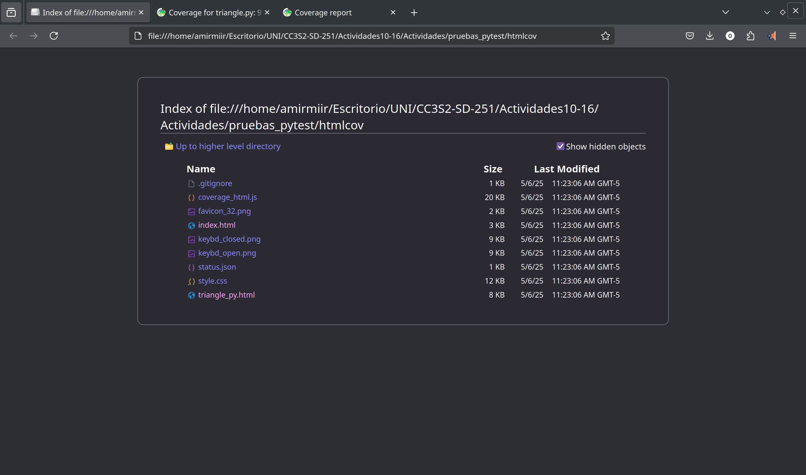
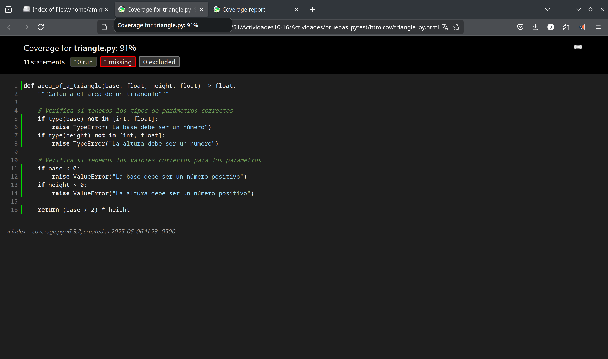
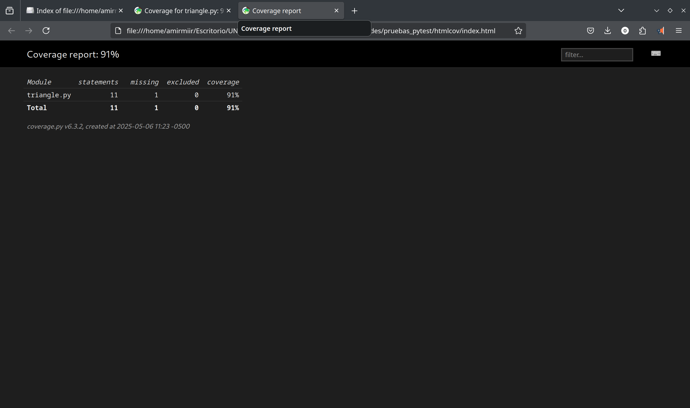
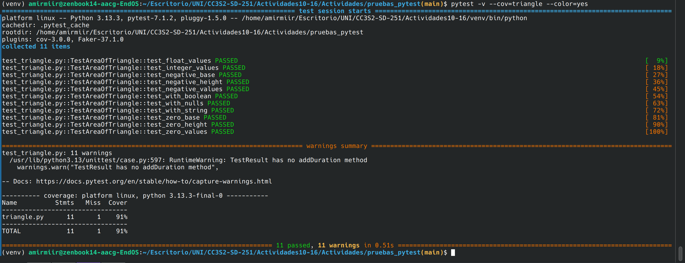
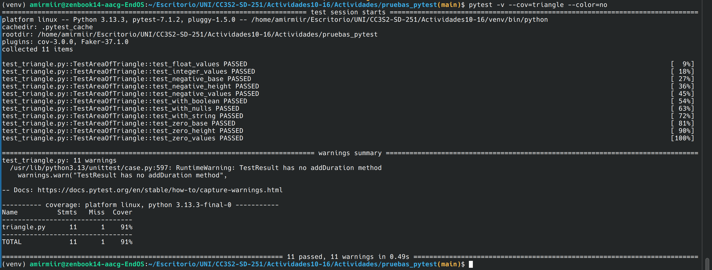

## Actividad 10 - Reporte

Dada mi distribución de Linux, la descarga directa de los paquetes de pytest y pytest-cov no se permite.

### Paso 1

Ejecución del código, nos resulta en que ya se cumplía, debido a que instalamos los requerimientos previamente:

```bash
(venv) amirmiir@zenbook14-aacg-EndOS:~/Escritorio/UNI/CC3S2-SD-251/Actividades10-16/Actividades/pruebas_pytest(main)$ python3 -m pip install pytest pytest-cov
Requirement already satisfied: pytest in /home/amirmiir/Escritorio/UNI/CC3S2-SD-251/Actividades10-16/venv/lib/python3.13/site-packages (7.1.2)
Requirement already satisfied: pytest-cov in /home/amirmiir/Escritorio/UNI/CC3S2-SD-251/Actividades10-16/venv/lib/python3.13/site-packages (3.0.0)
Requirement already satisfied: attrs>=19.2.0 in /home/amirmiir/Escritorio/UNI/CC3S2-SD-251/Actividades10-16/venv/lib/python3.13/site-packages (from pytest) (25.3.0)
Requirement already satisfied: iniconfig in /home/amirmiir/Escritorio/UNI/CC3S2-SD-251/Actividades10-16/venv/lib/python3.13/site-packages (from pytest) (2.1.0)
Requirement already satisfied: packaging in /home/amirmiir/Escritorio/UNI/CC3S2-SD-251/Actividades10-16/venv/lib/python3.13/site-packages (from pytest) (25.0)
Requirement already satisfied: pluggy<2.0,>=0.12 in /home/amirmiir/Escritorio/UNI/CC3S2-SD-251/Actividades10-16/venv/lib/python3.13/site-packages (from pytest) (1.5.0)
Requirement already satisfied: py>=1.8.2 in /home/amirmiir/Escritorio/UNI/CC3S2-SD-251/Actividades10-16/venv/lib/python3.13/site-packages (from pytest) (1.11.0)
Requirement already satisfied: tomli>=1.0.0 in /home/amirmiir/Escritorio/UNI/CC3S2-SD-251/Actividades10-16/venv/lib/python3.13/site-packages (from pytest) (2.2.1)
Requirement already satisfied: coverage>=5.2.1 in /home/amirmiir/Escritorio/UNI/CC3S2-SD-251/Actividades10-16/venv/lib/python3.13/site-packages (from coverage[toml]>=5.2.1->pytest-cov) (6.3.2)

[notice] A new release of pip is available: 25.0.1 -> 25.1.1
[notice] To update, run: pip install --upgrade pip
(venv) amirmiir@zenbook14-aacg-EndOS:~/Escritorio/UNI/CC3S2-SD-251/Actividades10-16/Actividades/pruebas_pytest(main)$ 

```


### Paso 2: **Escribiendo y ejecutando pruebas con pytest**

````bash
(venv) amirmiir@zenbook14-aacg-EndOS:~/Escritorio/UNI/CC3S2-SD-251/Actividades10-16/Actividades/pruebas_pytest(main)$ pytest -v
============================================================================= test session starts ==============================================================================
platform linux -- Python 3.13.3, pytest-7.1.2, pluggy-1.5.0 -- /home/amirmiir/Escritorio/UNI/CC3S2-SD-251/Actividades10-16/venv/bin/python
cachedir: .pytest_cache
rootdir: /home/amirmiir/Escritorio/UNI/CC3S2-SD-251/Actividades10-16/Actividades/pruebas_pytest
plugins: cov-3.0.0, Faker-37.1.0
collected 11 items                                                                                                                                                             

test_triangle.py::TestAreaOfTriangle::test_float_values PASSED                                                                                                           [  9%]
test_triangle.py::TestAreaOfTriangle::test_integer_values PASSED                                                                                                         [ 18%]
test_triangle.py::TestAreaOfTriangle::test_negative_base PASSED                                                                                                          [ 27%]
test_triangle.py::TestAreaOfTriangle::test_negative_height PASSED                                                                                                        [ 36%]
test_triangle.py::TestAreaOfTriangle::test_negative_values PASSED                                                                                                        [ 45%]
test_triangle.py::TestAreaOfTriangle::test_with_boolean PASSED                                                                                                           [ 54%]
test_triangle.py::TestAreaOfTriangle::test_with_nulls PASSED                                                                                                             [ 63%]
test_triangle.py::TestAreaOfTriangle::test_with_string PASSED                                                                                                            [ 72%]
test_triangle.py::TestAreaOfTriangle::test_zero_base PASSED                                                                                                              [ 81%]
test_triangle.py::TestAreaOfTriangle::test_zero_height PASSED                                                                                                            [ 90%]
test_triangle.py::TestAreaOfTriangle::test_zero_values PASSED                                                                                                            [100%]

=============================================================================== warnings summary ===============================================================================
test_triangle.py: 11 warnings
  /usr/lib/python3.13/unittest/case.py:597: RuntimeWarning: TestResult has no addDuration method
    warnings.warn("TestResult has no addDuration method",

-- Docs: https://docs.pytest.org/en/stable/how-to/capture-warnings.html
======================================================================= 11 passed, 11 warnings in 0.19s ========================================================================
(venv) amirmiir@zenbook14-aacg-E
ndOS:~/Escritorio/UNI/CC3S2-SD-251/Actividades10-16/Actividades/pruebas_pytest(main)$ 

````


### Paso 3: **Añadiendo cobertura de pruebas con pytest-cov**

Invocamos la llamada exactamente, notamos que sale error pues debemos indicar el nombre del paquete.

```bash
(venv) amirmiir@zenbook14-aacg-EndOS:~/Escritorio/UNI/CC3S2-SD-251/Actividades10-16/Actividades/pruebas_pytest(main)$ pytest --cov=nombre_de_tu_paquete
============================================================================= test session starts ==============================================================================
platform linux -- Python 3.13.3, pytest-7.1.2, pluggy-1.5.0
rootdir: /home/amirmiir/Escritorio/UNI/CC3S2-SD-251/Actividades10-16/Actividades/pruebas_pytest
plugins: cov-3.0.0, Faker-37.1.0
collected 11 items                                                                                                                                                             

test_triangle.py ...........                                                                                                                                             [100%]/home/amirmiir/Escritorio/UNI/CC3S2-SD-251/Actividades10-16/venv/lib/python3.13/site-packages/coverage/inorout.py:519: CoverageWarning: Module nombre_de_tu_paquete was never imported. (module-not-imported)
  self.warn(f"Module {pkg} was never imported.", slug="module-not-imported")
/home/amirmiir/Escritorio/UNI/CC3S2-SD-251/Actividades10-16/venv/lib/python3.13/site-packages/coverage/control.py:793: CoverageWarning: No data was collected. (no-data-collected)
  self._warn("No data was collected.", slug="no-data-collected")
WARNING: Failed to generate report: No data to report.

/home/amirmiir/Escritorio/UNI/CC3S2-SD-251/Actividades10-16/venv/lib/python3.13/site-packages/pytest_cov/plugin.py:308: CovReportWarning: Failed to generate report: No data to report.

  warnings.warn(CovReportWarning(message))


=============================================================================== warnings summary ===============================================================================
../../venv/lib/python3.13/site-packages/_pytest/assertion/rewrite.py:692
../../venv/lib/python3.13/site-packages/_pytest/assertion/rewrite.py:692
  /home/amirmiir/Escritorio/UNI/CC3S2-SD-251/Actividades10-16/venv/lib/python3.13/site-packages/_pytest/assertion/rewrite.py:692: DeprecationWarning: ast.Str is deprecated and will be removed in Python 3.14; use ast.Constant instead
    and isinstance(item.value, ast.Str)

../../venv/lib/python3.13/site-packages/_pytest/assertion/rewrite.py:694
  /home/amirmiir/Escritorio/UNI/CC3S2-SD-251/Actividades10-16/venv/lib/python3.13/site-packages/_pytest/assertion/rewrite.py:694: DeprecationWarning: Attribute s is deprecated and will be removed in Python 3.14; use value instead
    doc = item.value.s

test_triangle.py: 11 warnings
  /usr/lib/python3.13/unittest/case.py:597: RuntimeWarning: TestResult has no addDuration method
    warnings.warn("TestResult has no addDuration method",

-- Docs: https://docs.pytest.org/en/stable/how-to/capture-warnings.html

---------- coverage: platform linux, python 3.13.3-final-0 -----------

======================================================================= 11 passed, 14 warnings in 0.46s ========================================================================
(venv) amirmiir@zenbook14-aacg-EndOS:~/Escritorio/UNI/CC3S2-SD-251/Actividades10-16/Actividades/pruebas_pytest(main)$ 

```

Ajustamos el comando para mostrar respecto a nuestro paquete actual, `pytest --cov=pruebas_pytest`:

```bash
(venv) amirmiir@zenbook14-aacg-EndOS:~/Escritorio/UNI/CC3S2-SD-251/Actividades10-16/Actividades/pruebas_pytest(main)$ pytest --cov=pruebas_pytest
============================================================================= test session starts ==============================================================================
platform linux -- Python 3.13.3, pytest-7.1.2, pluggy-1.5.0
rootdir: /home/amirmiir/Escritorio/UNI/CC3S2-SD-251/Actividades10-16/Actividades/pruebas_pytest
plugins: cov-3.0.0, Faker-37.1.0
collected 11 items                                                                                                                                                             

test_triangle.py ...........                                                                                                                                             [100%]/home/amirmiir/Escritorio/UNI/CC3S2-SD-251/Actividades10-16/venv/lib/python3.13/site-packages/coverage/inorout.py:519: CoverageWarning: Module pruebas_pytest was never imported. (module-not-imported)
  self.warn(f"Module {pkg} was never imported.", slug="module-not-imported")
/home/amirmiir/Escritorio/UNI/CC3S2-SD-251/Actividades10-16/venv/lib/python3.13/site-packages/coverage/control.py:793: CoverageWarning: No data was collected. (no-data-collected)
  self._warn("No data was collected.", slug="no-data-collected")
WARNING: Failed to generate report: No data to report.

/home/amirmiir/Escritorio/UNI/CC3S2-SD-251/Actividades10-16/venv/lib/python3.13/site-packages/pytest_cov/plugin.py:308: CovReportWarning: Failed to generate report: No data to report.

  warnings.warn(CovReportWarning(message))


=============================================================================== warnings summary ===============================================================================
test_triangle.py: 11 warnings
  /usr/lib/python3.13/unittest/case.py:597: RuntimeWarning: TestResult has no addDuration method
    warnings.warn("TestResult has no addDuration method",

-- Docs: https://docs.pytest.org/en/stable/how-to/capture-warnings.html

---------- coverage: platform linux, python 3.13.3-final-0 -----------

======================================================================= 11 passed, 11 warnings in 0.47s ========================================================================
(venv) amirmiir@zenbook14-aacg-EndOS:~/Escritorio/UNI/CC3S2-SD-251/Actividades10-16/Actividades/pruebas_pytest(main)$ 

```

Añadimos un informe de cobertura en HTML, `pytest --cov=pruebas_pytest --cov-report=html`

```bash
(venv) amirmiir@zenbook14-aacg-EndOS:~/Escritorio/UNI/CC3S2-SD-251/Actividades10-16/Actividades/pruebas_pytest(main)$ pytest --cov=pruebas_pytest --cov-report=html
============================================================================= test session starts ==============================================================================
platform linux -- Python 3.13.3, pytest-7.1.2, pluggy-1.5.0
rootdir: /home/amirmiir/Escritorio/UNI/CC3S2-SD-251/Actividades10-16/Actividades/pruebas_pytest
plugins: cov-3.0.0, Faker-37.1.0
collected 11 items                                                                                                                                                             

test_triangle.py ...........                                                                                                                                             [100%]/home/amirmiir/Escritorio/UNI/CC3S2-SD-251/Actividades10-16/venv/lib/python3.13/site-packages/coverage/inorout.py:519: CoverageWarning: Module pruebas_pytest was never imported. (module-not-imported)
  self.warn(f"Module {pkg} was never imported.", slug="module-not-imported")
/home/amirmiir/Escritorio/UNI/CC3S2-SD-251/Actividades10-16/venv/lib/python3.13/site-packages/coverage/control.py:793: CoverageWarning: No data was collected. (no-data-collected)
  self._warn("No data was collected.", slug="no-data-collected")
WARNING: Failed to generate report: No data to report.

/home/amirmiir/Escritorio/UNI/CC3S2-SD-251/Actividades10-16/venv/lib/python3.13/site-packages/pytest_cov/plugin.py:308: CovReportWarning: Failed to generate report: No data to report.

  warnings.warn(CovReportWarning(message))


=============================================================================== warnings summary ===============================================================================
test_triangle.py: 11 warnings
  /usr/lib/python3.13/unittest/case.py:597: RuntimeWarning: TestResult has no addDuration method
    warnings.warn("TestResult has no addDuration method",

-- Docs: https://docs.pytest.org/en/stable/how-to/capture-warnings.html

---------- coverage: platform linux, python 3.13.3-final-0 -----------

======================================================================= 11 passed, 11 warnings in 0.48s ========================================================================
(venv) amirmiir@zenbook14-aacg-EndOS:~/Escritorio/UNI/CC3S2-SD-251/Actividades10-16/Actividades/pruebas_pytest(main)$ 

```

Evaluamos la cobertura especificamente para `triangle.py`, usando `pytest -v --cov=triangle`

```bash
(venv) amirmiir@zenbook14-aacg-EndOS:~/Escritorio/UNI/CC3S2-SD-251/Actividades10-16/Actividades/pruebas_pytest(main)$ pytest -v --cov=triangle
============================================================================= test session starts ==============================================================================
platform linux -- Python 3.13.3, pytest-7.1.2, pluggy-1.5.0 -- /home/amirmiir/Escritorio/UNI/CC3S2-SD-251/Actividades10-16/venv/bin/python
cachedir: .pytest_cache
rootdir: /home/amirmiir/Escritorio/UNI/CC3S2-SD-251/Actividades10-16/Actividades/pruebas_pytest
plugins: cov-3.0.0, Faker-37.1.0
collected 11 items                                                                                                                                                             

test_triangle.py::TestAreaOfTriangle::test_float_values PASSED                                                                                                           [  9%]
test_triangle.py::TestAreaOfTriangle::test_integer_values PASSED                                                                                                         [ 18%]
test_triangle.py::TestAreaOfTriangle::test_negative_base PASSED                                                                                                          [ 27%]
test_triangle.py::TestAreaOfTriangle::test_negative_height PASSED                                                                                                        [ 36%]
test_triangle.py::TestAreaOfTriangle::test_negative_values PASSED                                                                                                        [ 45%]
test_triangle.py::TestAreaOfTriangle::test_with_boolean PASSED                                                                                                           [ 54%]
test_triangle.py::TestAreaOfTriangle::test_with_nulls PASSED                                                                                                             [ 63%]
test_triangle.py::TestAreaOfTriangle::test_with_string PASSED                                                                                                            [ 72%]
test_triangle.py::TestAreaOfTriangle::test_zero_base PASSED                                                                                                              [ 81%]
test_triangle.py::TestAreaOfTriangle::test_zero_height PASSED                                                                                                            [ 90%]
test_triangle.py::TestAreaOfTriangle::test_zero_values PASSED                                                                                                            [100%]

=============================================================================== warnings summary ===============================================================================
test_triangle.py: 11 warnings
  /usr/lib/python3.13/unittest/case.py:597: RuntimeWarning: TestResult has no addDuration method
    warnings.warn("TestResult has no addDuration method",

-- Docs: https://docs.pytest.org/en/stable/how-to/capture-warnings.html

---------- coverage: platform linux, python 3.13.3-final-0 -----------
Name          Stmts   Miss  Cover
---------------------------------
triangle.py      11      1    91%
---------------------------------
TOTAL            11      1    91%

======================================================================= 11 passed, 11 warnings in 0.48s ========================================================================
(venv) amirmiir@zenbook14-aacg-EndOS:~/Escritorio/UNI/CC3S2-SD-251/Actividades10-16/Actividades/pruebas_pytest(main)$ 
```

Un informe más resumido, sin mostrar línea a línea qué es lo que está evaluandose, con el comando `pytest --cov=triangle --cov-report=term-missing`

```bash
(venv) amirmiir@zenbook14-aacg-EndOS:~/Escritorio/UNI/CC3S2-SD-251/Actividades10-16/Actividades/pruebas_pytest(main)$ pytest --cov=triangle --cov-report=term-missing
============================================================================= test session starts ==============================================================================
platform linux -- Python 3.13.3, pytest-7.1.2, pluggy-1.5.0
rootdir: /home/amirmiir/Escritorio/UNI/CC3S2-SD-251/Actividades10-16/Actividades/pruebas_pytest
plugins: cov-3.0.0, Faker-37.1.0
collected 11 items                                                                                                                                                             

test_triangle.py ...........                                                                                                                                             [100%]

=============================================================================== warnings summary ===============================================================================
test_triangle.py: 11 warnings
  /usr/lib/python3.13/unittest/case.py:597: RuntimeWarning: TestResult has no addDuration method
    warnings.warn("TestResult has no addDuration method",

-- Docs: https://docs.pytest.org/en/stable/how-to/capture-warnings.html

---------- coverage: platform linux, python 3.13.3-final-0 -----------
Name          Stmts   Miss  Cover   Missing
-------------------------------------------
triangle.py      11      1    91%
-------------------------------------------
TOTAL            11      1    91%

======================================================================= 11 passed, 11 warnings in 0.47s ========================================================================
(venv) amirmiir@zenbook14-aacg-EndOS:~/Escritorio/UNI/CC3S2-SD-251/Actividades10-16/Actividades/pruebas_pytest(main)$ 

```

Ahora con un reporte en HTML, `pytest --cov=triangle --cov-report=term-missing --cov-report=html`

````bash
(venv) amirmiir@zenbook14-aacg-EndOS:~/Escritorio/UNI/CC3S2-SD-251/Actividades10-16/Actividades/pruebas_pytest(main)$ pytest --cov=triangle --cov-report=term-missing --cov-report=html
============================================================================= test session starts ==============================================================================
platform linux -- Python 3.13.3, pytest-7.1.2, pluggy-1.5.0
rootdir: /home/amirmiir/Escritorio/UNI/CC3S2-SD-251/Actividades10-16/Actividades/pruebas_pytest
plugins: cov-3.0.0, Faker-37.1.0
collected 11 items                                                                                                                                                             

test_triangle.py ...........                                                                                                                                             [100%]

=============================================================================== warnings summary ===============================================================================
test_triangle.py: 11 warnings
  /usr/lib/python3.13/unittest/case.py:597: RuntimeWarning: TestResult has no addDuration method
    warnings.warn("TestResult has no addDuration method",

-- Docs: https://docs.pytest.org/en/stable/how-to/capture-warnings.html

---------- coverage: platform linux, python 3.13.3-final-0 -----------
Name          Stmts   Miss  Cover   Missing
-------------------------------------------
triangle.py      11      1    91%
-------------------------------------------
TOTAL            11      1    91%
Coverage HTML written to dir htmlcov

======================================================================= 11 passed, 11 warnings in 0.48s ========================================================================
(venv) amirmiir@zenbook14-aacg-EndOS:~/Escritorio/UNI/CC3S2-SD-251/Actividades10-16/Actividades/pruebas_pytest(main)$ 

````







### Paso 4: **Añadiendo colores automáticamente**

`--color=yes`



`--color=no`



### Paso 5: **Automatizando la configuración de pytest**

Ya tenemos el archivo setup.cgf configurado de la siguiente manera:

```bash
[tool:pytest]
addopts = -v --tb=short --cov=. --cov-report=term-missing

[coverage:run]
branch = True

[coverage:report]
show_missing = True
```


### Paso 6: **Ejecutando pruebas con la configuración automatizada**

Ejecución de pytest a partir de nuestro setup.cfg

```bash
(venv) amirmiir@zenbook14-aacg-EndOS:~/Escritorio/UNI/CC3S2-SD-251/Actividades10-16/Actividades/pruebas_pytest(main)$ pytest
============================================================================= test session starts ==============================================================================
platform linux -- Python 3.13.3, pytest-7.1.2, pluggy-1.5.0
rootdir: /home/amirmiir/Escritorio/UNI/CC3S2-SD-251/Actividades10-16/Actividades/pruebas_pytest
plugins: cov-3.0.0, Faker-37.1.0
collected 11 items                                                                                                                                                             

test_triangle.py ...........                                                                                                                                             [100%]

=============================================================================== warnings summary ===============================================================================
test_triangle.py: 11 warnings
  /usr/lib/python3.13/unittest/case.py:597: RuntimeWarning: TestResult has no addDuration method
    warnings.warn("TestResult has no addDuration method",

-- Docs: https://docs.pytest.org/en/stable/how-to/capture-warnings.html
======================================================================= 11 passed, 11 warnings in 0.14s ========================================================================
```


